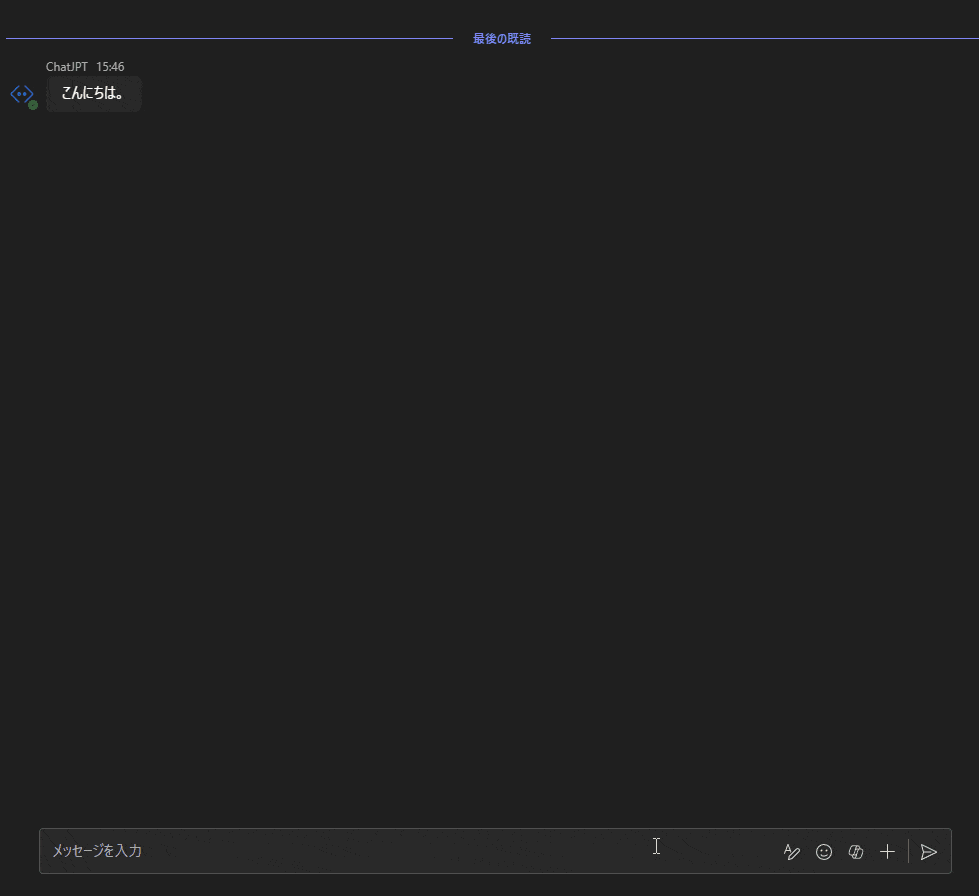
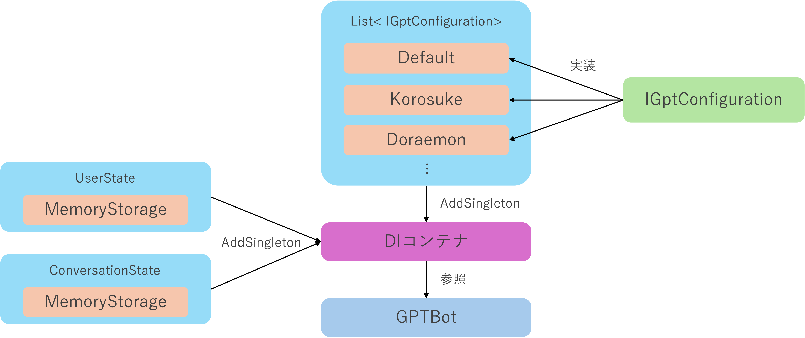

# SystemPromptSwitchingGPTBot
１つのボットでシステムプロンプトや各種パラメーターを切り替えながらChatGPTと対話できます。構想としてはGPTsを１つのボットの中で使うようなイメージです。
Teamsを前提に開発していますが、Azure Botを使用しているためSlackやLINEなどの各種チャットサービスにも対応しているはずです。

## セットアップ方法
### 前提条件
- このリポジトリをフォーク&クローンまたはダウンロード
- Azure OpenAI ServiceまたはOpenAIの準備
    - Azure OpenAI Service：GPT-35-turboまたはGPT-4のデプロイ

- ローカル実行を行う場合は以下の環境がローカルマシンに準備されていること
    - .NET 8
    - VS CodeまたはVisual Studio
    - Bot Framework Emulator
    - Azure CLI

### Azure OpenAI Serviceのデプロイ
1. Azure OpenAI Serviceをデプロイします。
1. gpt-35-turboまたはgpt-4のいずれかをデプロイします。

### システムプロンプト設定の改変
[app/GptConfiguration/](https://github.com/07JP27/SystemPromptSwitchingGPTBot/tree/main/app/GptConfiguration)ディレクトリ配下に各種システムプロンプトの設定ファイルがあります。これらのファイルを編集することでシステムプロンプトの設定を変更できます。また、`IGptConfiguration`を実装したクラスを作成することで独自のシステムプロンプト設定を新規作成することもできます。

### ローカル実行
1. 対象のAzure OpneAI Serviceのアクセス制御でローカル実行ユーザーにRBAC「Cognitive Services OpenAI User」ロールを付与します。**すでに共同作成者がついている場合でも必ず別途付与してください**
1. `appsettings.Development.json`にAzure OpenAI Serviceのエンドポイントとデプロイ名をセットします。
1. ターミナルで`az login`を実行してAzure OpenAI ServiceのリソースのRBACに登録したアカウントでAzureにログインします。
1. `dotnet run`または再生マークボタンでローカル実行します。
1. ローカルサーバーが起動したらBot Framework Emulatorで`http://localhost:3978/api/messages`に接続します。(ポートが異なる場合があります。環境に合わせてください。)
1. チャットできることを確認します。

### Azureへのデプロイ
#### Azure Web Appsのデプロイとセットアップ
1. Azure Web Appsをデプロイします。
1. システム割当マネージドIDの有効化します。
1. マネージドIDをAzure OpenAI Serviceのリソースのアクセス制御に「Cognitive Services OpenAI User」として追加します。

#### Azure Botのデプロイとセットアップ
1. Azure Botをデプロイします。
    1. データ所在地：「グローバル」
    1. 価格レベル：「Standard」
    1. アプリの種類：「シングルテナント」
    1. 作成の種類：「新しい Microsoft アプリ ID の作成」

1. デプロイしたAzure Botの「構成」メニューから以下の情報をメモします。
    - Microsoft App ID
    - アプリ テナントID

1. Microsoft App IDの横の「パスワードの管理」をクリックしてEntra IDのアプリ登録画面へ遷移します。
1. 「新しいクライアントシークレット」をクリックしてシークレットを作成します。作成したシークレットの「値」をメモします。**シークレットの値は作成直後しか表示されません。メモせずに画面遷移をすると２度と表示できないのでご注意ください。**

#### Azure Web Appsのアプリケーション設定
1. Azure Web Appsの「構成」メニューをクリックして「アプリケーション設定」を表示します。
1. 「新しいアプリケーション」をクリックして以下の6つのアプリケーション設定を登録します。
    - MicrosoftAppType：SingleTenant
    - MicrosoftAppId：Azure BotからメモしたMicrosoft App ID
    - MicrosoftAppPassword：Entra IDのアプリ登録で作成、メモしたクライアントシークレットの値
    - MicrosoftAppTenantId：Azure Botからメモしたアプリ テナントID
    - OpenAIEndpoint：Azure OpenAI Serviceのエンドポイント
    - OpenAIDeployName：Azure OpenAI Serviceのデプロイ名

1. 「保存」をクリックしてアプリケーション設定を反映します。

#### Azure Web Appsのアプリケーションデプロイ
- 本リポジトリにはデプロイ用のGitHub Actionsが含まれています。GitHub Actionsを使用してデプロイする場合はそれを使用してください。
- ローカルからデプロイする場合はaz cliやVS CodeのAzure App Service拡張機能を使用してデプロイしてください。

### Teamsでの動作確認
#### Manifestの作成
1. manifest/manifest.jsonの中の`<xxx>`となっているプレースホルダーをご自身の設定に書き換えます。
1. `manifest.json`、`color.png`、`outline.png`をzip圧縮します。このときに3つのファイルが入っているフォルダを圧縮するのではなく、3つのファイルを直接圧縮してください。フォルダを圧縮するとインポートできません。

#### Teamsへのインポート
- サイドローディングがサポートされている環境では[アプリをアップロード](https://learn.microsoft.com/ja-jp/microsoftteams/platform/concepts/deploy-and-publish/apps-upload#upload-your-app)して個人用のアプリをインストールすることができます。
- 組織全体に配布する場合はTeamsの管理者である必要があります。「Teams管理センター」へアクセスして「Teamsアプリ」→「アプリの管理」から「新しいアプリのアップロード」を選択して圧縮したmanifestファイルをアップロードします。